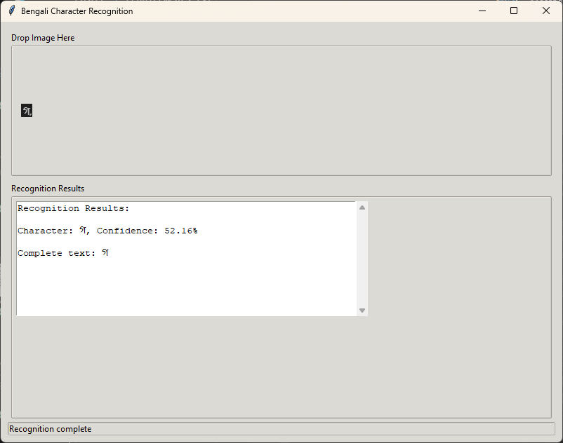
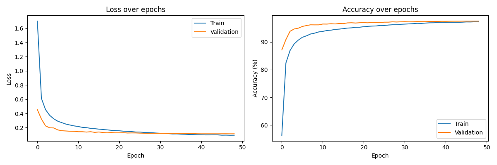

# ⚠️WARNING⚠️
The model is able to recognize characters only in perfect condition. Handwritten characters might not get recognized even if trained on `handwritten characters`.

# Bengali Character Recognition

A deep learning-based system for recognizing Bengali characters from images. The system features both a command-line interface and a graphical user interface with drag-and-drop support.



## Features

- Single and multiple character recognition
- Modern GUI with drag-and-drop support
- 97.48% validation accuracy
- CUDA-enabled for GPU acceleration
- Supports 62 Bengali characters including:
  - Basic characters
  - Numbers (০-৯)
  - Special characters and modifiers

## Quick Start

1. Install Python 3.9
2. Clone this repository
3. Setup virtual environment:
   ```powershell
   python -m venv venv
   .\venv\Scripts\activate
   pip install -r requirements.txt
   ```
4. Run the application:
   ```powershell
   .\run_recognition.bat
   ```

## Documentation

See [guide.md](guide.md) for detailed usage instructions.

## Model Performance



The model achieves 97.48% accuracy on the validation set. See [evaluation_report.txt](evaluation_report.txt) for detailed metrics.

## Requirements

- Python 3.9
- PyTorch with CUDA support (recommended)
- See requirements.txt for complete list

## License

MIT License
