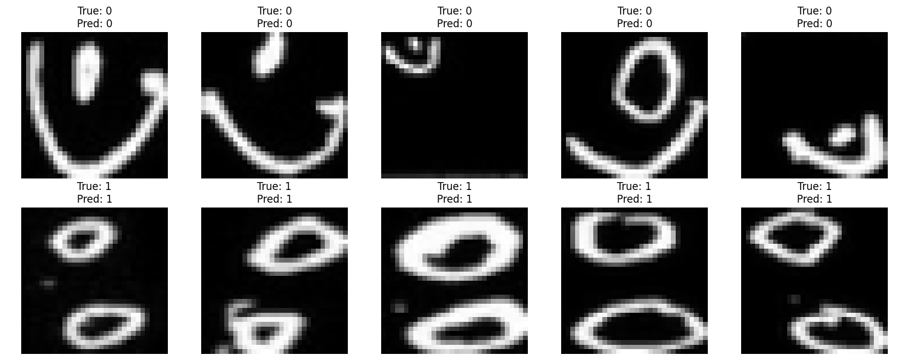
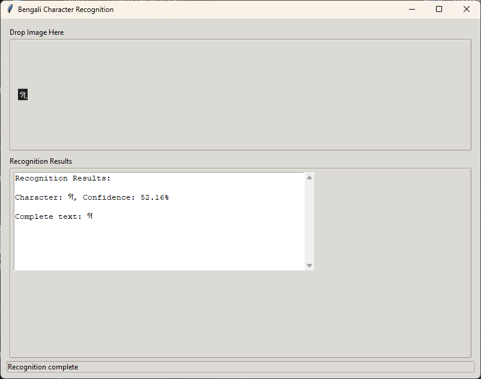

# Bengali Character Recognition - User Guide

## Overview
This application is designed to recognize Bengali characters from images. It supports both single character recognition and multiple character recognition from text images.


*Figure 1: Sample predictions showing recognized Bengali characters with confidence scores*

## Installation

1. Requirements:
   - Python 3.9
   - CUDA-capable GPU (recommended)
   - Windows 10 or later

2. Setup:
   ```powershell
   # Clone or download the repository
   # Navigate to the project directory
   # Create and activate virtual environment
   python -m venv venv
   .\venv\Scripts\activate

   # Install requirements
   pip install -r requirements.txt
   ```

## Using the Application

### Quick Start
1. Double-click `run_recognition.bat` or run:
   ```powershell
   .\run_recognition.bat
   ```

### GUI Interface

1. Main Window
   - Drop Zone: Area where you can drag and drop images
   - Preview: Shows the current image being processed
   - Results: Displays recognized characters and confidence scores
   - Status Bar: Shows current operation status

   
   *Figure 4: Main application window showing the drag-and-drop interface and results area*

   > Note: The interface uses a modern, clean design with the 'clam' theme for better visibility

2. Using the Interface:
   - **Drag and Drop**: Simply drag an image file into the drop zone
   - **Browse**: Click the drop zone to open file browser
   - **Supported Formats**: PNG, JPG, JPEG, BMP, GIF

3. Understanding Results:
   - Each recognized character is shown with its confidence score
   - Complete text is displayed at the bottom of results
   - Status bar shows processing status and any errors

### Supported Characters

The system recognizes 62 Bengali characters including:
- Basic characters (ক, খ, গ, etc.)
- Numbers (০-৯)
- Special characters and modifiers
- Vowel and consonant marks

### Best Practices

For best recognition results:
1. Image Quality:
   - Use clear, well-lit images
   - Ensure good contrast between text and background
   - Avoid blurry or distorted images

2. Character Spacing:
   - Leave adequate space between characters
   - Avoid overlapping characters
   - Keep text horizontal

3. Image Format:
   - Prefer PNG format for clearest results
   - Use reasonable resolution (not too small or large)
   - Maintain good image quality when scanning

### Troubleshooting

1. Application won't start:
   - Ensure Python 3.9 is installed
   - Check if virtual environment is activated
   - Verify all requirements are installed

2. Recognition errors:
   - Check image quality
   - Ensure characters are properly separated
   - Verify image format is supported

3. Performance issues:
   - Check GPU availability
   - Close other GPU-intensive applications
   - Reduce image size if too large

## Training Custom Models

If you want to train your own model:

1. Prepare dataset:
   - Organize images in data/train and data/val directories
   - Sort images by character classes
   - Follow existing folder structure

2. Run training:
   ```powershell
   .\train_model.ps1
   ```

3. Monitor progress:
   - Check console output for loss and accuracy
   - Model checkpoints saved in models/ directory
   - Training history plot generated after completion

## File Structure

```
├── bengali_gui.py       # GUI application
├── recognize_text.py    # Core recognition logic
├── model.py            # Neural network model
├── data_loader.py      # Data loading utilities
├── train.py           # Training script
├── evaluate.py        # Evaluation script
└── requirements.txt   # Dependencies
```

## Performance

Current model performance:
- Overall Accuracy: 97.48%
- GPU Support: CUDA-enabled for faster processing
- Batch Processing: Supported for multiple characters

### Training History

*Figure 2: Training progress showing loss and accuracy over epochs*

### Confusion Matrix

*Figure 3: Confusion matrix showing model performance across different Bengali characters*

The confusion matrix helps visualize:
- Correctly classified characters (diagonal)
- Common misclassifications
- Overall classification patterns

## Additional Resources

- Dataset: Organized Bengali character images
- Pre-trained Models: Available in models/ directory
- Evaluation Results: See evaluation_report.txt

## Support

For issues and questions:
1. Check troubleshooting section
2. Verify system requirements
3. Check error messages in status bar
4. Review image quality guidelines

## Updates and Maintenance

- Keep dependencies updated
- Check for model improvements
- Backup custom training data
- Monitor GPU drivers for updates
